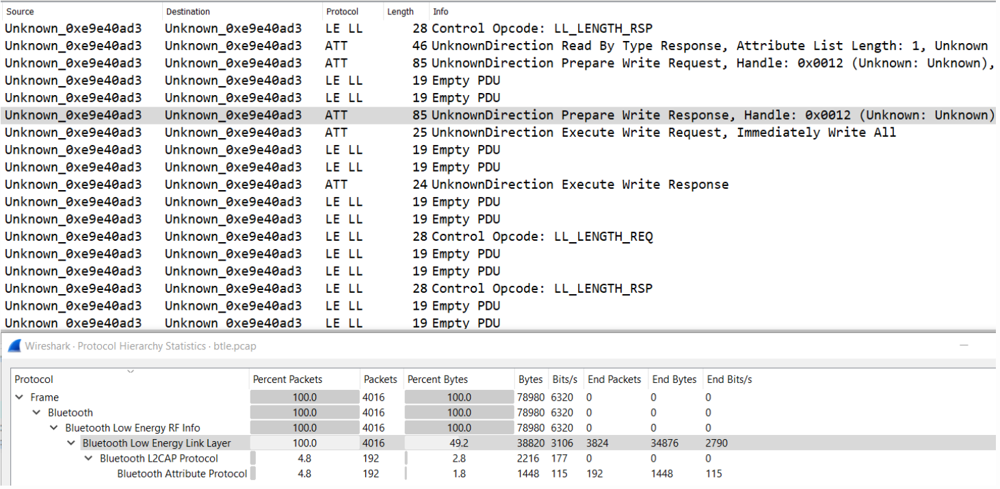
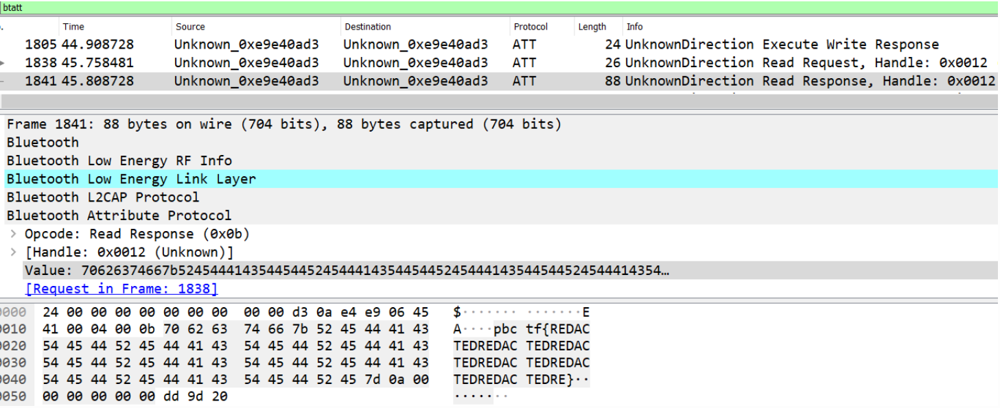

# BTLE Writeup

[原文地址](https://www.cnblogs.com/bamboo1111/p/15401402.html)

## 题目

我将我的标志存储在远程数据库中，但是当我试图读回它时，它已被编辑！你能恢复我写的东西吗？

添加一名作者

附：btle.pcap 

## 解析

在中打开捕获文件 wireshark，我们注意到大部分数据包只是来自蓝牙低功耗链路层 ( LE LL) 的空 PDU 。



蓝牙属性协议 ( `ATT`) 的数据包看起来更有趣，因为它们似乎包含读/写请求，这应该是指从挑战描述中所述的远程数据库中存储和检索标志。


如果我们过滤`btatt`并滚动到底部，我们可以在 Value 属性中发现一个包含已编辑标志的读取响应数据包。



在这个单一的读取请求/响应之前，有一大堆准备写入请求/响应，在不同的偏移量写入 Value 属性中的长字符串。这些也称为排队写入，它们都将由单独的执行写入请求操作码一起写入。


我假设这些以不同重叠偏移量写入的长字符串最终会相互覆盖并以明文形式留下标志，因此我使用[io.BytesIO 对象](https://docs.python.org/3/library/io.html#io.BytesIO)在 Python 中复制了这种行为，该[对象](https://docs.python.org/3/library/io.html#io.BytesIO)基本上表现得像一个文件，但只驻留在内存中。
在脚本中，我过滤了 Prepare Write Responses with `btatt.opcode == 0x16`，检索了 Value 属性并将它们写入`BytesIO`对象的相应偏移量处。

```python
import pyshark
import binascii
import io
cap = pyshark.FileCapture("btle.pcap", display_filter="btatt.opcode == 0x16")

flag = io.BytesIO()
for packet in cap:
	offset = int(packet.btatt.offset)
	flag.seek(offset)

	data = packet.btatt.value.replace(":", "")
	data = binascii.unhexlify(data)

	flag.write(data)

flag.seek(0)
flag.write(b"pb")

print(flag.getvalue())

cap.close()
```

我还在对象`b"pb"`的开头`BytesIO`（第 16-17 行）添加了一个额外的写入，因为在准备写入请求的海洋中，只有这两个字母有一个偷偷摸摸的标准写入。但是，当然，即使您错过了这一点，也没关系，因为标志格式是已知的，并且您会知道正确的前 2 个字母。


```cmd
C:\Downloads\PB\btle_solve.py
b'pbctf{b1Ue_te3Th_is_ba4d_4_y0u_jUs7_4sk_HAr0lD_b1U3tO07h}\n'
```

flag:
```bash
pbctf{b1Ue_te3Th_is_ba4d_4_y0u_jUs7_4sk_HAr0lD_b1U3tO07h}
```

